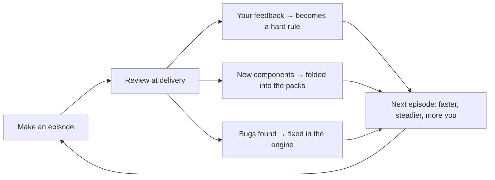

<p align="center">
  
</p>

<p align="center">
  <a href="README.md">简体中文</a> · <b>English</b>
</p>

<h1 align="center">Motion Video Workflow</h1>

<p align="center">
  <b>You record a voice-over. AI designs every frame live, and hands you back a 60fps motion video.</b>
</p>

<p align="center">
  
  
  
  
  
  
  
</p>

<table>
  <tr>
    <td align="center" width="33%"><br><b>Camera-continuous transitions, one shot</b></td>
    <td align="center" width="33%"><br><b>Say the word, the frame follows</b></td>
    <td align="center" width="33%"><br><b>Real web pages, rebuilt 1:1</b></td>
  </tr>
</table>

> Every frame above is drawn by code. No editing software, no templates, no AI-generated video. Change a second, and only that second re-renders — the output comes out identical every time.

---

## Six Superpowers

### 01 · Voice-driven timing


Offline transcription timestamps **every single word** in your voice-over. You don't copy timecodes by hand — you just write the word, and the animation finds its moment:

```js
const t = say('40k');        // → 22.59s — the number lands exactly on cue
say('save', 2);              // the 2nd time "save" is spoken
sayEnd('copy this');         // when the last word finishes
```

- Picture and voice stay within one frame (1/60s) of each other
- Transitions and camera moves snap to the music's beat automatically
- Re-recorded the voice-over? Re-transcribe once and the whole video re-times itself. No code changes.

<br clear="right">

### 02 · Camera-continuous transitions

Not "paper over the cut with an overlay" — the two shots on either side of a transition actually coexist for about half a second and share one motion curve. Camera movement carries straight across the cut, with up to 8 layers of motion blur stacked on top.

<table>
  <tr>
    <td align="center"><br><b>Push-through</b><br><sub>Push into an element — its inside is the next shot</sub></td>
    <td align="center"><br><b>Whip pan</b><br><sub>Same direction, same speed, whips straight into the next shot</sub></td>
    <td align="center"><br><b>Shape match</b><br><sub>A card morphs in place into a phone screen</sub></td>
  </tr>
  <tr>
    <td align="center"><br><b>Foreground wipe</b><br><sub>A foreground plane sweeps past — the scene behind has already changed</sub></td>
    <td align="center"><br><b>Focus pull</b><br><sub>Out of focus fades out, in focus resolves in</sub></td>
    <td align="center"><br><b>Pull-out reveal</b><br><sub>The whole frame shrinks down into a single icon</sub></td>
  </tr>
</table>

<p align="center"><a href="docs/showcase/transitions-30s.mp4">▶ Watch the full 30-second demo (all 6 transitions, back to back)</a></p>

AI picks the transition based on the voice-over: it only cuts where the information actually changes, reaches for shape match when two elements share a silhouette, and pulls out to reveal when going from a detail back to the big picture. A one-minute video uses 3–4 of these, and the flashiest one is saved for the climax.

### 03 · Designed per episode, not templated

The component packs are just the foundation. For every episode, AI **designs and writes the code live**, based on what the voice-over actually says: it reaches for an existing component when one fits, and writes a new one when nothing does — when reusing one would look too close to a past episode, or the climax needs something memorable — and notes why in the shot list. In the first 56-second episode, about half the code was written on the spot.

These 12 frames all come from the same engine, and look nothing alike:

<table>
  <tr>
    <td align="center"><br><sub>Porcelain keynote</sub></td>
    <td align="center"><br><sub>Late-night neon</sub></td>
    <td align="center"><br><sub>Tech grid</sub></td>
    <td align="center"><br><sub>Clean whiteboard</sub></td>
    <td align="center"><br><sub>Magazine collage</sub></td>
    <td align="center"><br><sub>Curved portfolio wall</sub></td>
  </tr>
  <tr>
    <td align="center"><br><sub>Terminal tutorial</sub></td>
    <td align="center"><br><sub>Product chat</sub></td>
    <td align="center"><br><sub>Data dashboard</sub></td>
    <td align="center"><br><sub>Layered structure</sub></td>
    <td align="center"><br><sub>Outro call-to-action</sub></td>
    <td align="center"><br><sub>Aurora timeline</sub></td>
  </tr>
</table>

### 04 · Real UI, rebuilt


If the voice-over mentions a tool or a product, the screen has to show the real thing.

- One command grabs a 2x screenshot of a web page, closing cookie banners and login popups automatically
- It also exports the exact coordinates of every button and heading, so framing, push-ins, and click animations are placed by coordinate — not eyeballed
- Elements that need their own animation (a button, a stat card) get rebuilt 1:1 from the screenshot
- Every asset's source and license gets logged automatically into `a/来源.md`

The clip on the right was built live after scraping this repo's own GitHub page.

<br clear="right">

### 05 · You just pick


The whole process is multiple choice: aspect ratio, music, style, title — every question comes with a recommended answer. You can also look at a full keyframe overview before committing to anything. Say "just do it" and it runs straight through on the recommended choices, then tells you what it picked.

AI also **checks its own preview frames** — looking for cropped text, overlapping elements, type that's too small — and fixes what it finds.

### 06 · Gets better every episode



At the end of every episode, AI sorts what it learned into three buckets and lists them out. You check off the ones you agree with, and it folds those into the skill. The longer you use it, the better it knows your taste.

---

## Pipeline


---

## Comparison

| | CapCut templates | Manual AE / Premiere | AI text-to-video | Code frameworks (Remotion, etc.) | **Motion Video Workflow** |
|---|---|---|---|---|---|
| Synced to voice-over, word by word | Drag it by hand | Mark points by hand | Can't | You write it | **Automatic** |
| Looks different every episode | Easy to repeat a look | Depends on the editor | Random draw | You write it | **AI designs it live, per episode** |
| Frame-accurate edits | Limited | Yes | Only by regenerating | Yes | **Yes — change a second, only that second re-renders** |
| Real UI and real text | Manual screenshots | Manual | Text often garbled | You write it | **Auto-captured + rebuilt 1:1** |
| Learning curve | Low | High | Low | Need to code | **Low — it's all multiple choice** |
| Cost | Subscription | Software + a lot of time | Pay per generation | Free | **Free, fully local** |

---

## What's inside

<details>
<summary><b>43 components</b> (click to expand)</summary>

| Pack | Components |
|---|---|
| Explainer `explainer` | Kinetic text, keyword cards, flow chains, side-by-side compare, timeline, big stat, bar chart, layered structure, callout box, status pill, 5 animated backgrounds, ~25 line icons |
| News `news` | News card, social post, scrolling ticker, ranking |
| Tutorial `tutorial` | Browser / app window, cursor clicks, type-on text, code block, terminal, spotlight, step badge |
| Product `product-ui` | Phone chat (push in message by message), push notification, call screen (timer + waveform + chat bubbles) |
| Mascot `mascot` | Transparent character pop-in / peek-from-edge / idle floating, soft gradient camera backdrop |
| Vertical `vertical` | Vertical canvas and camera, stamp text, seal stamp, character reveal, stat box, toast, keycap, impact burst |
| Web `web` | Scrolling long screenshot, screenshot callout box, screenshot crop/zoom, frame-by-frame video playback in a card |
| Outro `outro` | Favorite button, follow card, pinned comment |
| Engine `engine` | Camera push/pull, handheld drift, shake, flash, chromatic aberration, film grain, confetti, beat-synced cuts, voice-over timing lookup |

</details>

<details>
<summary><b>13 transitions</b></summary>

| Type | Transitions |
|---|---|
| Camera-continuous | Push-through, pull-out reveal, whip pan, shape match, foreground wipe, focus pull |
| Mask wipes | Brush-stroke wipe, bar wipe, iris, circle reveal, rect reveal, push-through wipe, whip |

</details>

<details>
<summary><b>5 vertical shells + the toolchain</b></summary>

- Shells: night, tech, clean, paper, porcelain
- Tools: audio mix (auto-ducks music under voice), offline word-by-word transcription, beat detection, auto-generated backing track, voice-over timing lookup, web scraping, frame preview, parallel segment rendering, HEVC encode, 3:4 and 4:3 cover export

</details>

---

## Best with Claude

This skill was built and tuned on **Claude Code + Claude Opus**, and that's where it runs best:

- **Multiple-choice confirmations**: Claude Code's built-in choice tool asks you directly, one click to answer
- **Self-checking by eye**: Claude can look at its own rendered preview frames and fix what's wrong
- **Designing on the spot**: every episode means writing hundreds to thousands of lines of fresh animation code and making visual calls — exactly what Claude is good at

Other agents that support `SKILL.md`, like Codex, work too (choice prompts become numbered options, and showing an image becomes giving a file path) — the interaction and self-checking just aren't as smooth as in Claude Code.

---

## Install

**Claude Code (recommended)**

```bash
git clone https://github.com/isaachang/motion-video-workflow ~/.claude/skills/motion-video-workflow
```

To scope it to a single project, use `your-project/.claude/skills/motion-video-workflow` instead. Restart Claude Code after installing and it'll pick it up automatically.

**Codex**

```bash
git clone https://github.com/isaachang/motion-video-workflow ~/.agents/skills/motion-video-workflow
```

For a single project, use `your-project/.agents/skills/`; older Codex versions use `~/.codex/skills/`. Call it with `$motion-video-workflow`, or just describe what you need and it triggers automatically.

**First run** doesn't need any manual setup: AI copies the template into your project directory and runs `bash tools/setup.sh`, which installs the Python dependencies, the Playwright browser, and the ~250MB offline transcription model. If a Chinese font isn't available, it downloads the open-source Noto Sans SC automatically.

## Usage

Prep a voice-over (a phone recording is fine), then tell your AI:

```text
Use motion-video-workflow to turn ~/Desktop/voiceover.mp3 into a 9:16 motion video.
The topic is introducing site XX, and here's the voice-over script: ...
```

From there: confirm the basics (aspect ratio, music) → optionally preview a look first → confirm title, color palette, and shot list → optionally preview the full keyframe overview → render → you get the final video, two covers, and a list of improvements worth folding back into the skill.

## Requirements

macOS / Linux / WSL, Python 3.10+, ffmpeg. Everything else gets installed automatically by `tools/setup.sh`. No GPU needed, no API key needed.

---

## For AI agents

> If you're an AI assistant reading this repo:

- **Start at [`SKILL.md`](SKILL.md)**: the full workflow, the points where you must stop and ask the user, the hard rules for visuals, output specs, and the camera-transition rules. Read it in full before you start.
- **The template lives in `motion-kit/`**: copy it into the project directory per episode and edit the copy — **don't edit the template inside the skill directory directly**. The component list is in [`motion-kit/README.md`](motion-kit/README.md).
- **The user only needs to provide the voice-over.** Confirm aspect ratio, music, style, and title with multiple-choice questions, recommended option first — don't re-ask anything the user already told you.
- **Don't hand-copy timestamps.** Use `say('word')` or `python3 tools/when.py word`.
- **Don't invent data or news.** Mark illustrative content as such on screen, and log asset sources in `a/来源.md`.

You can paste this straight to your AI:

```text
Install https://github.com/isaachang/motion-video-workflow as my skill (Claude Code: ~/.claude/skills/, Codex: ~/.agents/skills/),
read through SKILL.md, then tell me what I need to prepare to make a motion video.
```

## Layout

```
motion-video-workflow/
├── SKILL.md              # Workflow docs (the AI's entry point)
├── motion-kit/           # Template: copy per episode, then edit the copy
│   ├── engine/           # Timeline engine + mask-wipe transitions
│   ├── packs/            # 9 component packs (incl. camera transitions in transition.js, mascot.js)
│   ├── shell/            # 9:16 decorative shells
│   ├── tools/            # Audio, transcription, screenshots, chroma key, keyframe sheet, render, covers
│   └── examples/muse/    # Source for the first episode (reference only, no assets)
└── docs/                 # Demo assets for this README and their source (all code-generated, all fictional)
```

## License

- Everything shown in this README is code-generated, fictional content; the source is in [`docs/showcase-src/`](docs/showcase-src/).
- When you reference a real product or someone else's work, follow their terms of use and credit the original creator on screen.
- Auto-generated backing tracks and code-drawn graphics carry no copyright issues; if you pick your own music, use a commercially licensed library.
- The code is [MIT](LICENSE) licensed. The bundled Inter font and the auto-downloaded Noto Sans SC are both SIL OFL licensed.

<p align="center"><sub>Made with Claude Code · if it helped you make a good video, a star would mean a lot</sub></p>
