<p align="center">
  
</p>

<p align="center">
  <b>简体中文</b> · <a href="README.en.md">English</a>
</p>

<h1 align="center">Motion Video Workflow</h1>

<p align="center">
  <b>你录一段配音，AI 现场设计每一帧，交出一支 60fps 的口播动效片。</b><br>
  <sub>A Claude Code skill that turns a voice-over into a frame-accurate, code-rendered motion video.</sub>
</p>

<p align="center">
  <a href="CHANGELOG.md"></a>
  
  
</p>

<table>
  <tr>
    <td align="center" width="33%">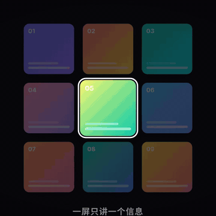<br><b>一镜到底的运镜转场</b></td>
    <td align="center" width="33%">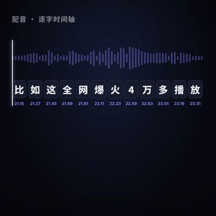<br><b>说到哪个字，画面就到哪一帧</b></td>
    <td align="center" width="33%">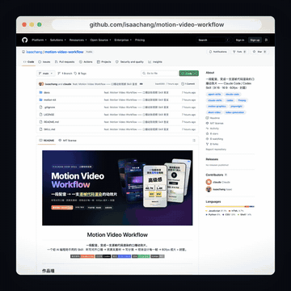<br><b>真实网页 1:1 还原</b></td>
  </tr>
</table>

> 上面每一帧都是代码画的：没有剪辑软件、没有模板、没有 AI 生成视频。改哪一秒就重画哪一秒，每次渲染结果完全一致。

---

## 六大绝活 · Six Superpowers

### 01 · 配音逐字驱动 · Voice-driven timing


离线听写给配音里的**每一个字**标上时间。写动画时不用手抄秒数，直接写说到哪个词：

```js
const t = say('4万');        // → 22.59，数字就在这一帧砸出来
say('收藏', 2);              // 第 2 次说「收藏」的时刻
sayEnd('抄作业');            // 最后一个字的时刻
```

- 画面和口播的误差在一帧以内（1/60 秒）
- 转场、镜头运动自动吸附到音乐拍点上
- 重录配音？重新听写一次，全片自动跟上新的时间，代码一行不改

<br clear="right">

### 02 · 一镜到底的运镜转场 · Camera-continuous transitions

不是「盖一层东西把切点遮住」，而是**前后两个镜头在转场的那半秒里同时存在、共用同一条运动曲线**。镜头运动跨过切点也不断，再叠加最多 8 层运动模糊。

<table>
  <tr>
    <td align="center">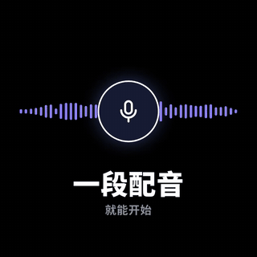<br><b>推进穿越</b><br><sub>推进一个元素，它的内部就是下一镜</sub></td>
    <td align="center">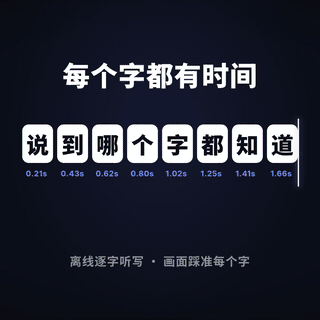<br><b>甩镜衔接</b><br><sub>同方向、同速度甩进下一镜</sub></td>
    <td align="center">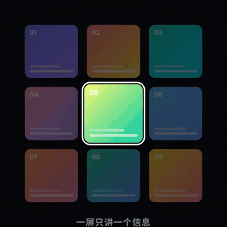<br><b>形状匹配</b><br><sub>卡片原地变形成手机屏幕</sub></td>
  </tr>
  <tr>
    <td align="center">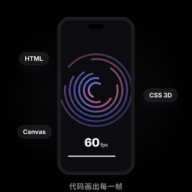<br><b>前景遮挡</b><br><sub>前景板划过，背后已换场景</sub></td>
    <td align="center">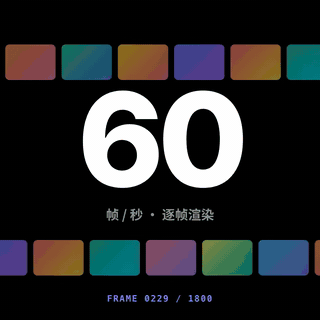<br><b>景深转换</b><br><sub>虚焦淡出，对焦浮现</sub></td>
    <td align="center">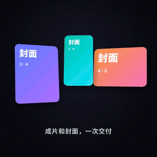<br><b>拉远揭示</b><br><sub>整个画面缩成一枚图标</sub></td>
  </tr>
</table>

<p align="center"><a href="docs/showcase/transitions-30s.mp4">▶ 看 30 秒完整演示片（6 种转场连续衔接）</a></p>

AI 会按口播自己判断：只在信息切换处转，有形状相似的元素就用形状匹配，从细节回到全局就用拉远揭示，一分钟的片子用 3–4 次，留一个最炸的给高潮。

### 03 · 每期现场设计，不套模板 · Designed per episode

组件包只是底座。AI 每期都按口播内容**现场设计、现场写代码**：现成组件能表达的直接用，表达不了、会和往期撞脸、高潮需要记忆点的，就新写，并在分镜表里标明为什么。第一期 56 秒的片子，约一半代码是现场写的。

下面 12 张来自同一套引擎，风格完全不同：

<table>
  <tr>
    <td align="center">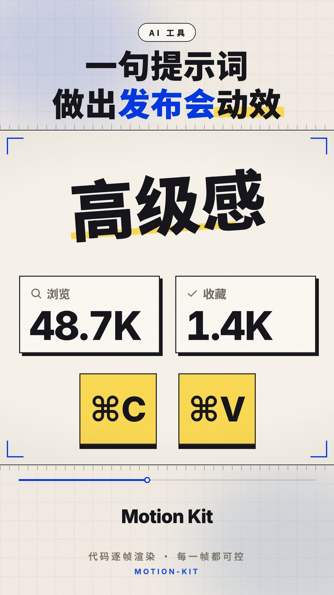<br><sub>白瓷发布会</sub></td>
    <td align="center"><br><sub>深夜霓虹</sub></td>
    <td align="center">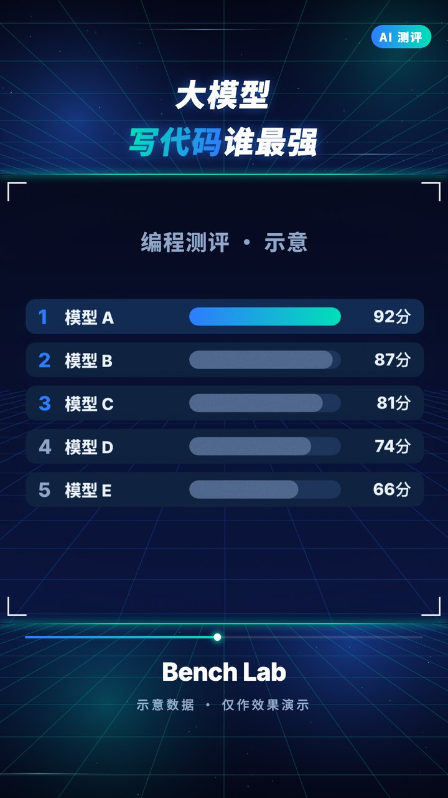<br><sub>科技网格</sub></td>
    <td align="center">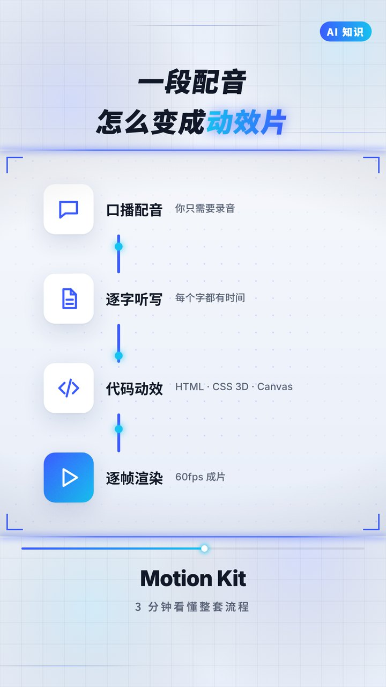<br><sub>清爽白板</sub></td>
    <td align="center">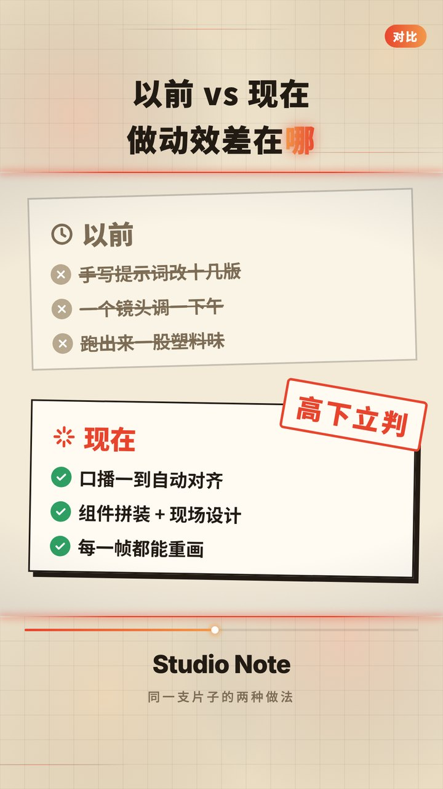<br><sub>杂志拼贴</sub></td>
    <td align="center">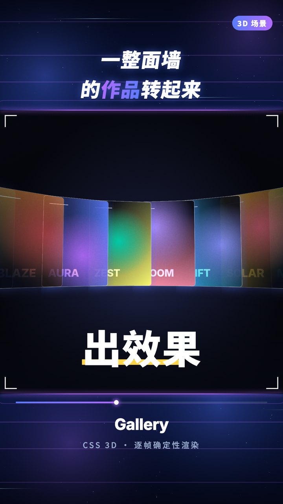<br><sub>弧形作品墙</sub></td>
  </tr>
  <tr>
    <td align="center">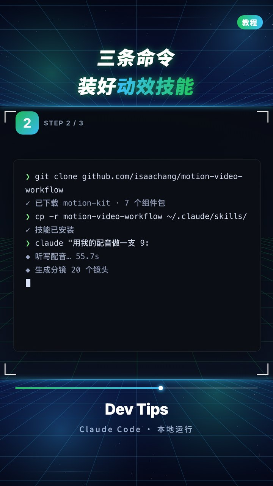<br><sub>终端教程</sub></td>
    <td align="center"><br><sub>产品对话</sub></td>
    <td align="center">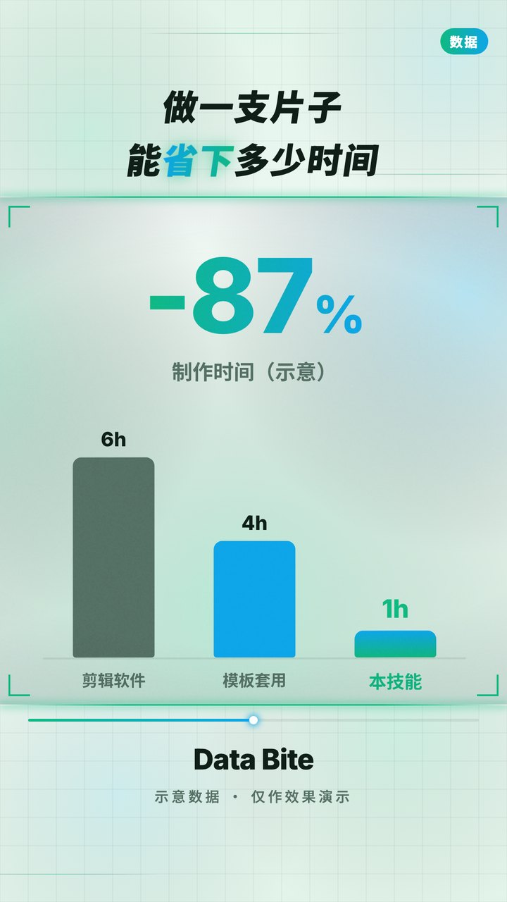<br><sub>数据看板</sub></td>
    <td align="center">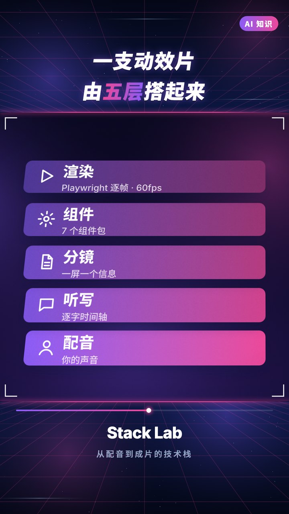<br><sub>分层结构</sub></td>
    <td align="center"><br><sub>片尾引导</sub></td>
    <td align="center">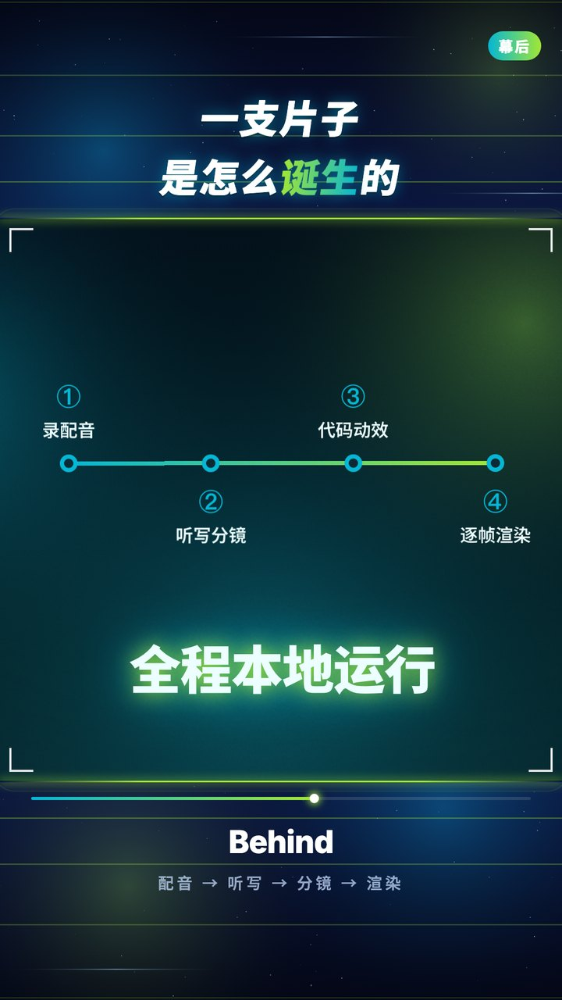<br><sub>极光时间线</sub></td>
  </tr>
</table>

### 04 · 真实网页 1:1 还原 · Real UI, rebuilt


讲工具、讲产品，画面里必须是真东西。

- 一条命令抓取网页的 2x 高清截图，自动关掉 Cookie、登录这类弹窗
- 同时导出每个按钮、标题的精确坐标，框选、推近、鼠标点击都按坐标来，不靠肉眼估
- 需要单独做动画的元素（按钮、数据卡），照截图 1:1 重建
- 每个素材的来源和许可自动记进 `a/来源.md`

右边这段就是抓取本仓库的 GitHub 页面后，现场做出来的。

<br clear="right">

### 05 · 你只做选择题 · You just choose

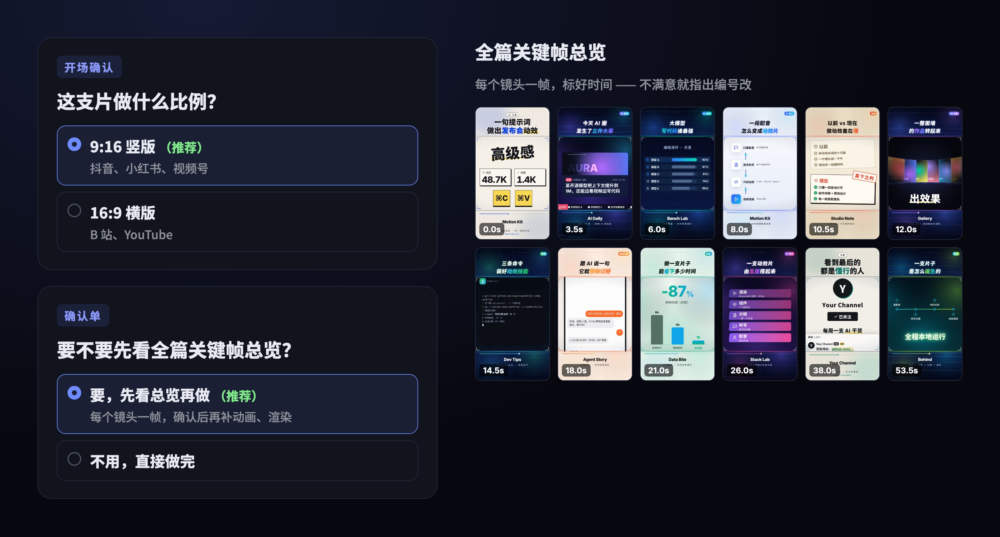

整个流程里，你只需要点选项：比例、音乐、风格、标题，每题都有推荐项。还可以先看**全篇关键帧总览**再开工。说一句「直接做」，它就全部按推荐走完，最后告诉你替你选了什么。

AI 还会**自己看预览帧**，检查文字有没有被裁、元素有没有重叠、字够不够大，发现问题自己修。

### 06 · 越用越强 · Gets better every episode

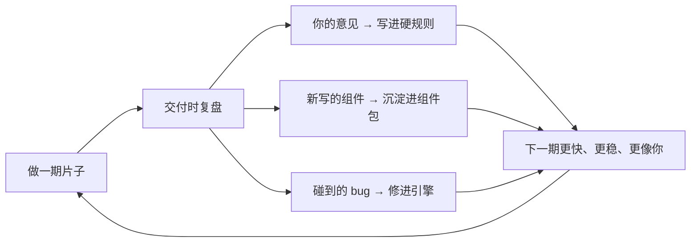

每期交付时，AI 会把这期的收获分成三类列出来，你勾选同意的，它再更新进 skill。用得越久，越懂你的审美。

---

## 一支片是怎么诞生的 · Pipeline

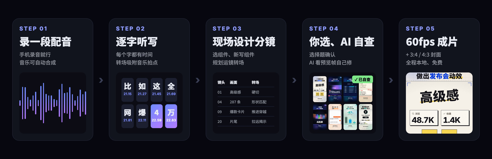

---

## 和别的方案比 · Comparison

| | 剪映模板 | AE / PR 手工 | AI 文生视频 | Remotion 等代码框架 | **Motion Video Workflow** |
|---|---|---|---|---|---|
| 和口播逐字对齐 | 手动拖 | 手动打点 | 做不到 | 自己写 | **自动** |
| 每期不重样 | 容易撞款 | 看人 | 随机抽卡 | 自己写 | **AI 按内容现场设计** |
| 精确到帧地修改 | 有限 | 可以 | 只能重新生成 | 可以 | **可以，改哪秒重画哪秒** |
| 真实界面、文字 | 手工截图 | 手工 | 常出错字 | 自己写 | **自动抓取 + 1:1 重建** |
| 上手门槛 | 低 | 高 | 低 | 要会写代码 | **低：只做选择题** |
| 成本 | 会员 | 软件 + 大量时间 | 按次计费 | 免费 | **免费、全程本地** |

---

## 能力清单 · What's inside

<details>
<summary><b>43 个组件</b>（点开看全部）</summary>

| 组件包 | 组件 |
|---|---|
| 知识讲解 `explainer` | 动态文字、关键词卡、流程链、左右对比、时间线、大数字、柱状图、分层结构、标注框、状态胶囊、5 种动态背景、约 25 个线性图标 |
| AI 资讯 `news` | 新闻卡、社交帖、滚动快讯条、排行榜 |
| 教程 `tutorial` | 浏览器 / 应用窗口、鼠标点击、逐字打字、代码块、终端、聚光灯、步骤徽章 |
| 产品案例 `product-ui` | 手机聊天（逐条推近）、推送通知、通话界面（计时 + 声波 + 对话气泡） |
| 角色 / IP 形象 `mascot` | 透明角色弹出 / 从边缘探出 / 呼吸浮动、柔光渐变镜头底 |
| 竖版 `vertical` | 竖版画布和镜头、印章大字、盖章、逐字浮现、数据格、提示条、键帽、冲击线 |
| 真实网页 `web` | 浏览器加长图滚动、截图框选、截图局部放大、卡片内逐帧播放视频 |
| 片尾 `outro` | 收藏、关注、评论区置顶 |
| 引擎 `engine` | 镜头推拉、手持漂移、抖动、闪白、色散、胶片颗粒、彩屑、拍点卡点、口播时间查询 |

</details>

<details>
<summary><b>13 种转场</b></summary>

| 类型 | 转场 |
|---|---|
| 运镜转场（镜头连续） | 推进穿越、拉远揭示、甩镜衔接、形状匹配、前景遮挡、景深转换 |
| 遮罩转场 | 笔刷擦屏、色条擦屏、光圈、圆形揭示、矩形揭示、穿越推镜、甩镜 |

</details>

<details>
<summary><b>5 种 9:16 装饰带 + 工具链</b></summary>

- 装饰带：深夜 night、科技 tech、清爽 clean、纸感 paper、白瓷 porcelain
- 工具：混音（人声自动压低音乐）、离线逐字听写、拍点检测、自动合成配乐、口播时间查询、网页抓取、抽帧预览、分段并行渲染、HEVC 合成、3:4 和 4:3 封面导出

</details>

---

## 为什么推荐 Claude Code · Best with Claude

这个 skill 在 **Claude Code + Claude Opus 5.5** 上开发和打磨，**强烈推荐用 Opus 5.5 运行**。每期都要现写上千行动画代码，换成更小的模型也能跑，但画面会简单很多：

- **选择题确认**：用 Claude Code 自带的选择题工具问你，点一下就能选
- **看图自查**：Claude 能直接看自己渲染的预览帧，发现问题自己修
- **现场设计**：每期都要现写几百到上千行动画代码、做视觉设计，这正是 Claude 擅长的

Codex 等支持 `SKILL.md` 的 agent 也能用（选择题会变成编号选项，发图会变成给出图片路径），只是交互和自查不如 Claude Code 顺手。

---

## 安装 · Install

**Claude Code（推荐）**

```bash
git clone https://github.com/isaachang/motion-video-workflow ~/.claude/skills/motion-video-workflow
```

只给某个项目用，就换成 `你的项目/.claude/skills/motion-video-workflow`。装好后重开 Claude Code，会自动识别。

**Codex**

```bash
git clone https://github.com/isaachang/motion-video-workflow ~/.agents/skills/motion-video-workflow
```

项目级放 `你的项目/.agents/skills/`；较早的 Codex 版本用 `~/.codex/skills/`。输入 `$motion-video-workflow` 调用，或直接描述需求自动触发。

**第一次运行**不用手动装依赖：AI 会把模板复制到项目目录，运行 `bash tools/setup.sh`，自动安装 Python 依赖、Playwright 浏览器、约 250MB 的离线听写模型，缺中文字体会自动下载开源的思源黑体。

## 怎么用 · Usage

准备一段配音（手机录音就行），对 AI 说：

```text
用 motion-video-workflow，把 ~/Desktop/配音.mp3 做成一支 9:16 的口播动效片。
主题是介绍 XX 网站，口播稿如下：……
```

接下来：开场确认（比例、音乐）→ 要不要先看效果图 → 确认标题、配色、分镜 → 要不要先看全篇关键帧总览 → 渲染 → 交付成片和两张封面，并列出可以沉淀进 skill 的改进。

## 依赖 · Requirements

- **模型**：推荐 Claude Opus 5.5
- **系统**：macOS / Linux / WSL，Python 3.10+，ffmpeg。其余依赖由 `tools/setup.sh` 自动安装。不需要 GPU，也不需要任何 API Key

---

## 给 AI 看的说明 · For AI agents

> 如果你是正在读这个仓库的 AI 助手：

- **入口是 [`SKILL.md`](SKILL.md)**：完整的工作流、必须停下来问用户的节点、画面硬规则、输出规范、运镜转场规则。开始前完整读一遍。
- **模板在 `motion-kit/`**：每支片先复制一份到项目目录再改，**不要直接改 skill 目录里的模板**。组件清单见 [`motion-kit/README.md`](motion-kit/README.md)。
- **用户只需要提供配音**。比例、音乐、风格、标题都用选择题确认，推荐项放第一个；用户说了的不要重复问。
- **时间点不要手抄**：用 `say('词')` 或 `python3 tools/when.py 词`。
- **不编造数据和新闻**，示意内容在画面里标「示意」，素材来源记进 `a/来源.md`。

可以把这段直接发给你的 AI：

```text
请把 https://github.com/isaachang/motion-video-workflow 安装成我的 skill（Claude Code 放 ~/.claude/skills/，Codex 放 ~/.agents/skills/），
读一遍 SKILL.md，然后告诉我做一支口播动效片需要准备什么。
```

## 目录结构 · Layout

```
motion-video-workflow/
├── SKILL.md              # 工作流说明（AI 的入口）
├── CHANGELOG.md          # 更新日志：每个版本改了什么
├── motion-kit/           # 模板：每支片复制一份再改
│   ├── engine/           # 时间轴引擎 + 遮罩转场
│   ├── packs/            # 9 个组件包（含运镜转场 transition.js、角色 mascot.js）
│   ├── shell/            # 9:16 装饰带
│   ├── tools/            # 音频、听写、抓图、抠图、关键帧总览、渲染、封面
│   └── examples/muse/    # 第一支片的源码（仅参考，不含素材）
└── docs/                 # README 用的演示素材和它们的源码（全部为代码生成的虚构内容）
```

## 素材与版权 · License

- README 里的所有画面都是代码生成的虚构内容，源码在 [`docs/showcase-src/`](docs/showcase-src/)。
- 引用真实产品或别人的作品时，请遵守对方的使用条款，画面里标注原作者。
- 自动合成的配乐和代码画出的图形没有版权问题；自己挑音乐时请选可商用的曲库。
- 代码采用 [MIT](LICENSE) 许可。内置字体 Inter 和自动下载的思源黑体（Noto Sans SC）均为 SIL OFL 许可。

<p align="center"><sub>Made with Claude Code · 如果它帮你做出了好片子，欢迎点个 Star</sub></p>
