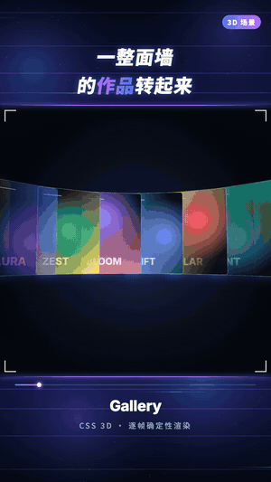
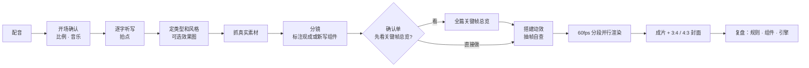

<p align="center">
  
</p>

<h1 align="center">Motion Video Workflow</h1>

<p align="center">
  <b>一段配音，变成一支逐帧代码渲染的口播动效片。</b><br>
  一个给 AI 编程助手用的 Skill：听写对齐口播 → 抓真实素材 → 写分镜 → 现场设计每一帧 → 60fps 成片 + 封面。
</p>

<p align="center">
  
  
  
  
  
</p>

---

## 作品墙

下面 12 张都是这个 Skill 的组件包直接渲染出来的 9:16 成片画面。同一套引擎，12 种完全不同的风格。

<table>
  <tr>
    <td align="center"><br><b>白瓷发布会</b><br><sub>印章大字 · 数据格 · 键帽</sub></td>
    <td align="center"><br><b>深夜霓虹</b><br><sub>AI 资讯 · 新闻卡 · 快讯条</sub></td>
    <td align="center"><br><b>科技网格</b><br><sub>排行榜 · 透视网格</sub></td>
    <td align="center"><br><b>清爽白板</b><br><sub>知识讲解 · 流程链</sub></td>
  </tr>
  <tr>
    <td align="center"><br><b>杂志拼贴</b><br><sub>以前 vs 现在 · 盖章</sub></td>
    <td align="center"><br><b>弧形作品墙</b><br><sub>CSS 3D · 旋转视频墙</sub></td>
    <td align="center"><br><b>终端教程</b><br><sub>命令行逐字输入 · 步骤徽章</sub></td>
    <td align="center"><br><b>产品对话</b><br><sub>案例分享 · 手机聊天</sub></td>
  </tr>
  <tr>
    <td align="center"><br><b>数据看板</b><br><sub>大数字 · 柱状图</sub></td>
    <td align="center"><br><b>分层结构</b><br><sub>3D 技术栈</sub></td>
    <td align="center"><br><b>片尾引导</b><br><sub>关注 · 评论区置顶</sub></td>
    <td align="center"><br><b>极光时间线</b><br><sub>时间线 · 发光关键词</sub></td>
  </tr>
</table>

<p align="center">
  <br>
  <sub>动起来是这样的：入场、镜头推拉、数字跳动、按键按下，全部和口播逐字对齐</sub>
</p>

> 效果图里的内容（新闻、数据、对话、频道名）全部是代码生成的虚构示例，源码在 [`docs/showcase-src/`](docs/showcase-src/)。

---

## 它能做什么

| | |
|---|---|
| **配音驱动** | 离线逐字听写，每个字都有时间。说到「4 万」的那一帧，数字正好跳出来。转场吸附到音乐拍点上 |
| **代码逐帧渲染** | 画面全部由 HTML、CSS 3D、Canvas 画出，浏览器逐帧截图后合成 60fps 视频。想改哪一秒就重画哪一秒，每次渲染结果完全一致 |
| **每期都不重样** | 引擎和组件复用，画面、配色、版式按每期内容现场设计。不是套模板 |
| **真实素材** | 自动抓网页 2x 截图（会关掉 Cookie 弹窗），从官网拿 logo，界面按截图 1:1 重建，素材来源全部记录在案 |
| **竖版装饰带** | 9:16 采用「上标题带 / 中内容窗 / 下信息带」排版，内置 5 种风格：night、tech、clean、paper、porcelain |
| **没有音乐也能做** | 可以自动合成和口播段落对齐的配乐，冲击音、痛点段抽鼓都会自动处理（自己挑的音乐效果更好） |
| **封面一起出** | 每期都出 3:4 竖版和 4:3 横版两张封面 |
| **关键节点让你拍板** | 每个问题都是选择题，带推荐选项；可以先看全篇关键帧总览再开工 |

---

## 为什么推荐用 Claude Code

这个 Skill 在 **Claude Code + Claude Opus** 上开发和打磨，效果最好，原因有三个：

- **选择题确认**：Skill 用 Claude Code 自带的选择题工具（AskUserQuestion）问你比例、风格、标题，点一下就能选。
- **看图自查**：Claude 能直接看自己渲染出来的预览帧，自己发现文字被裁、元素重叠、字太小这些问题，再修好。
- **代码动效能力**：每期都要现场写几百到上千行动画代码、做视觉设计，这正是 Claude 擅长的。

Codex 等支持 `SKILL.md` 的 agent 也能用，Skill 里写了降级方案：选择题改成编号选项，发图改成给出图片路径。只是交互和自查不如 Claude Code 顺手。

---

## 安装

### Claude Code（推荐）

```bash
git clone https://github.com/isaachang/motion-video-workflow ~/.claude/skills/motion-video-workflow
```

装到某个项目里只给这个项目用，就把路径换成 `你的项目/.claude/skills/motion-video-workflow`。装好后重开一次 Claude Code，它会自动识别这个 Skill。

### Codex

```bash
git clone https://github.com/isaachang/motion-video-workflow ~/.agents/skills/motion-video-workflow
```

项目级就放在 `你的项目/.agents/skills/`。较早的 Codex 版本使用 `~/.codex/skills/`。在 Codex 里输入 `$motion-video-workflow` 调用，或者直接描述需求让它自动触发。

### 第一次运行

不用手动装依赖。第一次做片时，AI 会把 `motion-kit/` 复制到你的项目目录，然后运行 `bash tools/setup.sh`：安装 Python 依赖和 Playwright 浏览器，下载约 250MB 的离线听写模型，检查 ffmpeg 和中文字体（缺字体会自动下载开源的思源黑体）。

---

## 怎么用

准备好一段配音（手机录音就行），然后对 AI 说：

```text
用 motion-video-workflow，把 ~/Desktop/配音.mp3 做成一支 9:16 的口播动效片。
主题是介绍 XX 网站，口播稿如下：……
```

接下来大致是这样：

1. **开场确认**（一次问完）：输出比例？背景音乐自己找（推荐），还是自动合成？
2. **效果图**：要不要先看 2–3 个视觉方向的 9:16 效果图？
3. **确认单**：顶部标题、底部文案、配色、分镜表，每项都有推荐选项；最后问要不要先看全篇关键帧总览。
4. **制作和渲染**：后台并行渲染 60fps 成片。
5. **交付**：成片、3:4 和 4:3 两张封面、素材来源清单；另外列出这期可以沉淀进 Skill 的改进建议，由你勾选。

你只需要做选择题。说一句「直接做」，它就全部按推荐选项走完，最后告诉你替你选了什么。

---

## 工作流



---

## 组件包

| 组件包 | 内容 |
|---|---|
| `engine/core.js` | 时间轴引擎：每一帧都是时间 t 的函数；镜头推拉、手持漂移、抖动、闪白、色散、颗粒、彩屑；`say('词')` 查口播时间 |
| `engine/fx.js` | 转场：笔刷擦屏、色条擦屏、光圈、穿越推镜、甩镜、重拍缩放 |
| `packs/explainer.js` | 知识讲解：动态文字、关键词卡、流程链、对比、时间线、大数字、柱状图、分层、标注框、背景 |
| `packs/news.js` | AI 资讯：新闻卡、社交帖、滚动快讯、排行榜 |
| `packs/tutorial.js` | 教程：浏览器或应用窗口、光标点击、打字、代码块、终端、聚光灯、步骤徽章 |
| `packs/product-ui.js` | 产品案例：手机聊天（逐条推近）、推送通知 |
| `packs/vertical.js` | 竖版专用画布；印章大字、盖章、逐字浮现、数据格、提示条、键帽、冲击线 |
| `packs/web.js` | 真实网页：浏览器加长图滚动、截图框选、截图局部放大、卡片内逐帧播放视频 |
| `packs/outro.js` | 片尾：收藏、关注、评论区置顶 |
| `shell/` | 9:16 装饰带：`vframe.js`（night / tech / clean / paper）、`vframe-porcelain.js`（白瓷） |
| `tools/` | 混音、听写、拍点、合成配乐、查口播时间、抓网页、预览、渲染、合成、封面 |

完整说明见 [`motion-kit/README.md`](motion-kit/README.md)。

---

## 依赖

- macOS / Linux / WSL
- Python 3.10+、ffmpeg
- 其余依赖（Playwright Chromium、sherpa-onnx 听写模型、librosa 等）由 `tools/setup.sh` 自动安装
- 不需要 GPU，也不需要任何 API Key，全程本地运行

---

## 给 AI 看的说明

> 如果你是正在读这个仓库的 AI 助手，下面是你需要知道的。

- **入口是 [`SKILL.md`](SKILL.md)**。它是完整的工作流说明，包括每一步做什么、哪里必须停下来问用户、画面硬规则、输出规范。开始前先完整读一遍。
- **模板在 `motion-kit/`**。每支片都先复制一份到项目目录再改，**不要直接改 Skill 目录里的模板**。组件清单见 `motion-kit/README.md`。
- **用户只需要提供配音**。比例、音乐、风格、标题都通过选择题确认（推荐项放第一个）。用户说了的就不要重复问。
- **时间点不要手抄**：用 `say('词')` 或 `python3 tools/when.py 词` 查口播时间。
- **不编造数据和新闻**，示意内容要在画面里标「示意」；素材来源记进 `a/来源.md`。
- 帮用户安装时：Claude Code 放到 `~/.claude/skills/motion-video-workflow/`；Codex 放到 `~/.agents/skills/motion-video-workflow/`。

可以把下面这段直接发给你的 AI：

```text
请把 https://github.com/isaachang/motion-video-workflow 安装成我的 skill（Claude Code 放 ~/.claude/skills/，Codex 放 ~/.agents/skills/），
读一遍 SKILL.md，然后告诉我做一支口播动效片需要准备什么。
```

---

## 目录结构

```
motion-video-workflow/
├── SKILL.md              # 工作流说明（AI 的入口）
├── motion-kit/           # 模板：每支片复制一份再改
│   ├── engine/           # 时间轴引擎 + 转场
│   ├── packs/            # 组件包
│   ├── shell/            # 9:16 装饰带
│   ├── tools/            # 音频、听写、抓图、渲染、封面
│   ├── examples/muse/    # 第一支片的源码（仅参考，不含素材）
│   └── index.html · vertical.html · cover.html · config.js
└── docs/                 # README 用的效果图和它们的源码
```

---

## 素材与版权

- 引用真实产品或别人的作品时，请遵守对方的使用条款，画面里要标注原作者。Skill 会把每个素材的来源记录在 `a/来源.md`。
- 自动合成的配乐和代码画出的图形没有版权问题；自己挑音乐时请选可商用的曲库。
- 本仓库代码采用 [MIT](LICENSE) 许可。内置字体 Inter 和自动下载的思源黑体（Noto Sans SC）均为 SIL OFL 许可。

<p align="center"><sub>Made with Claude Code · 如果它帮你做出了好片子，欢迎点个 Star</sub></p>
